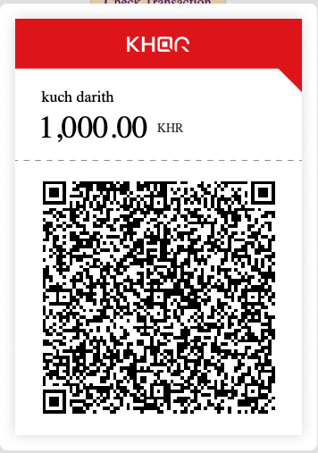

# Welcome to KHQR Documentation

This is the  documents not officail by Bakong NBC **KHQR Documents**, which provides:

- How to use ***apikhqr***.
- How to intergrate ***apikhqr*** with web broswer as client site.
- Tutorials for beginners to get started quickly.
- Support individual KHQR generate.
- Support client site run on web broswer.
---

## Features

- Configuration option to support ***apikhqr***.
- Generate KHQR from ***apikhqr***.
- Auto check transaction status after payment completed.
- Manual check the transaction status.
---


## Here is an image showing the KHQR




---

## Here how to configuration
- Register developer account with Bakong Open API for personal user. [Visit Link](https://api-bakong.nbc.gov.kh/register)
- Register personal account for Bakong to receive money.  [Visit Link](https://bakong.nbc.gov.kh)
- Register account with Morecambodia.com to us our API. [Visit Link](https://morecambodia.com)

## Before use API after register
- Full verification for bakong personal account on your mobile.
- Confirm bakong api account with us.

## How to use
```
<head>
    <script src="https://cdn.jsdelivr.net/gh/kdrtech/KHQRService@latest/public/app/dist/khqr-sdk.js"></script>
    <script src="https://code.jquery.com/jquery-3.7.1.min.js" crossorigin="anonymous"></script>
    <script src="https://cdnjs.cloudflare.com/ajax/libs/axios/1.2.1/axios.min.js"></script>
    <script src="https://cdn.jsdelivr.net/gh/kdrtech/KHQRService@latest/public/app/dist/APIKhqrSDK.js"></script>
</head>
//Init  api
<script>
    ApiKhqrModule.getKHQR().onInitSDK(window.AccountTesting.apkKey, {
        showDialog: true,
        allowClose: true,
        alertSuccess: true
    });
</script>
```
## ApiKhqrModule
- window.AccountTesting.apkKey : This is your api see on your profile on morcambodia.com(please replace your apikey).
- showDialog : Generate KHQR two type if true mean show popup dialog else you can get KHQR to replace where you want to show.
- allowClose : Allow when generate KHQR let user close popup if ture will show button close else not(note will effect if you set showDialog as true)
- alertSuccess : Allow when payment completed will show dialog, if true show else not show.
## Events
1. onPaymentStatus : This function when payment completed will call.
```
ApiKhqrModule.getKHQR().onPaymentStatus = (data) => {

}
```
2. startGernerateKHQR : Allow you start generate your KHQR. note must be use async funtion to call startGernerateKHQR.
```
 (async () => {
    ApiKhqrModule.getKHQR().startGernerateKHQR({
        amount: 100
    });
 })();
```
- amount: Total amount you want to generate KHHQR.
3. getQRView : Allow you get KHQR view to show where you want. This function effect when you set showDialog = false. 
```

var khqrView = ApiKhqrModule.getKHQR().getQRView();

Exmple:
document.getElementById("khqr-body").innerHTML = "";
document.getElementById("khqr-body").innerHTML = ApiKhqrModule.getKHQR().getQRView();

```

## License
You are free to use, modify, and distribute this software in accordance with the following terms:
- Usage: This software is provided "as is," without any express or implied warranties, including, but not limited to, warranties of merchantability or fitness for a particular purpose.
- Liability: The creator of this software is not responsible for any consequences, damages, or losses that may arise from its use.
- Attribution: (Optional: Add this if you require credit) Credit must be given to the original creator when redistributing or modifying the software.
- Responsibility: Users of this software are solely responsible for determining the appropriateness of using it for their applications. The creator assumes no responsibility for compliance with any legal or regulatory obligations that may arise.
- Disclaimer: The software is licensed without any guarantee or assurance of performance, reliability, or security.

Refer to the navigation menu for more details about each module.


## Support Us
Hello everyone 👋

If you want to support me, feel free to do so. 

Thanks

============================================

សួស្ដី អ្នកទាំងអស់គ្នា👋 

បើ​អ្នក​ចង់​គាំទ្រ​ខ្ញុំ សូម​ធ្វើ​ដោយ​សេរី , 

សូមអរគុណ

<a  href="https://www.buymeacoffee.com/kdrtech" target="_blank">

</a>
